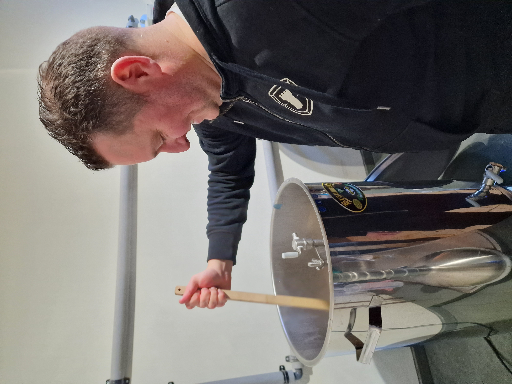
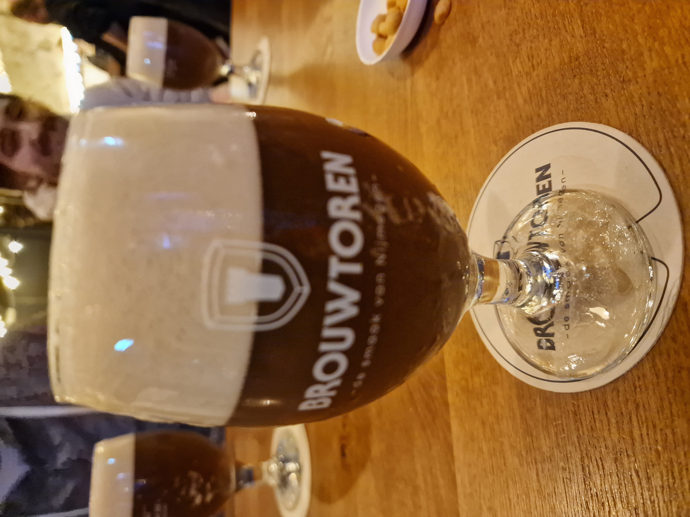
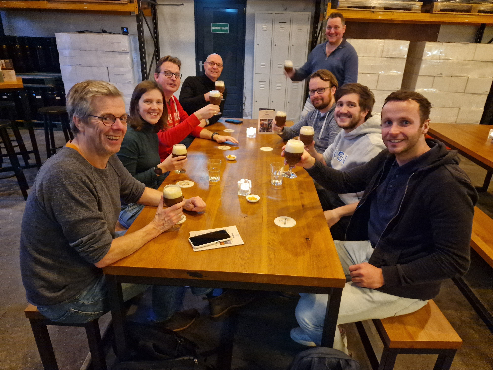

<html lang="en">
  <head>
    <!-- Required meta tags -->
    <meta charset="utf-8">
    <meta name="viewport" content="width=device-width, initial-scale=1">

    <!-- Bootstrap CSS -->
    <link href="https://cdn.jsdelivr.net/npm/bootstrap@5.0.2/dist/css/bootstrap.min.css" rel="stylesheet" integrity="sha384-EVSTQN3/azprG1Anm3QDgpJLIm9Nao0Yz1ztcQTwFspd3yD65VohhpuuCOmLASjC" crossorigin="anonymous">
    <link rel="stylesheet" href="https://unpkg.com/leaflet@1.6.0/dist/leaflet.css">
    <link rel="stylesheet" href="https://unpkg.com/leaflet.markercluster@1.5.3/dist/MarkerCluster.css"/>
    <link rel="stylesheet" href="https://unpkg.com/leaflet.markercluster@1.5.3/dist/MarkerCluster.Default.css"/>
    
    

  </head>
  <body>
    <h2>'t Perceeltje</h2>
    

      De unieke samenwerking tussen het Kadaster Data Science Team en de brouwers van Brouwtoren heeft geresulteerd in ’t Perceeltje. Een modern bier in vele opzichten.
    

    <!-- Button trigger modal -->
  <button type="button" class="btn btn-primary" data-bs-toggle="modal" data-bs-target="#exampleModal">
    Lees meer
  </button>
    <button type="button" class="btn btn-primary" data-bs-toggle="modal" data-bs-target="#exampleModal1">
    Sfeerimpressie
  </button>
  

    
Onderstaande kaart toont de locaties waar ‘t Perceeltje is gedronken, en de herkomst van ingrediënten. Drink locaties worden toegevoegd door middel van de “Deel mijn drink locatie” knop. We zijn trots op ons unieke biertje en willen graag weten wat jij ervan vindt. Geef 't Perceeltje daarom een beoordeling op Untappd.
  

  <button onclick="location.href='https://untp.beer/375ecb09fc'" type="button" class="btn btn-primary">
    Untappd Check-in
  </button>
  <button onclick="getLocation()" type="button" class="btn btn-primary">
    Deel mijn drink locatie
  </button>
   
  <!-- Modal -->
  

    

      

        

          <h5 class="modal-title" id="exampleModalLabel">'t Perceeltje</h5>
          <button type="button" class="btn-close" data-bs-dismiss="modal" aria-label="Close"></button>
        

        

          <b> Een modern bier, met de smaak van AI - hoe dan? </b>
           
          Het Kadaster heeft een Data Science Team die zich richt op de toepassing van kunstmatige intelligentie op Kadaster gerelateerde data, zoals notariële aktes en luchtfoto's. Dit met als doel om de kwaliteit van de data te verbeteren en bruikbare data producten te leveren. Voor meer informatie, bezoek https://labs.kadaster.nl/. Naast deze inspanningen ontstond het idee om de kennis van AI te gebruiken voor iets waar we allemaal van houden: bier. Dat idee hebben we gerealiseerd in samenwerking met Brouwtoren, een jonge en innovatieve brouwerij in Nijmegen.
           
           
          <b>Het recept:</b>
           
          Als je bier wilt maken, heb je een recept nodig, en daar ligt een kans voor het toepassen van AI. Dat is mooi beschreven in dit <a href="https://medium.com/@koenvandenheuvel/how-to-brew-a-beer-with-artificial-intelligence-6c742f5fd843">artikel</a>, onze inspiratiebron.  Het startpunt zijn de 201 recepten van de Schotse brouwer Brewdog die open beschikbaar zijn (helaas zijn ze 1 van de weinige brouwers die dit doen). Daarnaast weten we de scores van deze biertjes op basis van Untappd beoordelingen. Dit is de basis waarop we het AI model trainen, en daarbij een miljoen recepten genereren met daarbij een voorspelling van de potentiële Untappd score. De recepten van de hoogste scores hebben we meegenomen naar de brouwers van Brouwtoren. Want naast AI komt er toch ook wel wat vakmanschap kijken bij het maken van bier: we hadden bijvoorbeeld wel de ingrediënten en de hoeveelheden maar nog niet op welk moment welke hop toegevoegd moest worden. Dat hebben de brouwers bepaald.
           
           
          <b>Proefbrouw - meer data:</b>
           
          Vervolgens hebben we als Data Science Team het recept gebrouwen onder begeleiding van de Brouwtoren brouwers. Het resultaat hiervan is op de tap gekomen in het Proeflokaal van Brouwtoren. Met behulp van evaluatieformulieren is meer data verzameld en op basis daarvan is het recept nog licht bijgesteld, met name om de nasmaak minder bitter te maken.
           
           
          <b>Duurzame aanpassingen:</b>
           
          Mede omdat de basisrecepten vanuit Brewdog komen, maar ook omdat (helaas) de meesten mouten en hoppen uit het buitenland komen, bevatte het basisrecept ook deze mouten en hoppen. Dat kan beter en duurzamer vinden wij! Alle mouten en hoppen hebben we vervangen voor duurzame lokale vervangers: Brabanthop heeft de cascade, chinook en centennial hops gekweekt. De pilsmout, tarwemout, carafa type 1 mout, chocolademout zijn Nederlandse granen en door Vloermouterij Masterveld (Winterswijk) gemout en geleverd. Alleen de BlackSwaen-BlackExtra is een Duits graan, en in Nederland gemout. Al met al kunnen we dus spreken over een lokaal en duurzaam bier.
           
           
          <b>Nog meer AI toegepast:</b>
           
          Er zijn nog meer mogelijkheden om AI toe te passen: het etiket. Het plaatje (de landmeter met een biertje)  op de voorkant van het etiket is gegenereerd middels DALL-E-2. Een nieuw AI-systeem dat realistische afbeeldingen en kunst kan maken van een beschrijving in natuurlijke taal. Op de achterkant van het etiket staat de tekst: "Onze machine learning-technologie heeft bier gebrouwen zo lekker, dat je denkt dat robots de brouwmeesters zijn. Maar geen zorgen, er is geen kans dat het bier opstandig wordt en de wereld overneemt, tenzij je te veel drinkt natuurlijk." Deze tekst is geschreven door ChatGPT.
           
           
          <b>Nog meer Kadaster:</b>
           
          Naast duurzaamheid hebben we nog meer “Kadaster”  waarden geprobeerd te vertalen naar dit project. Allereerst transparantie en openheid: We zijn volledig open en transparant over het bier, dat betekent dat het recept openbaar beschikbaar is, en we nodigen iedereen uit om dit recept verder te verbeteren.
          Als Kadaster zijn we van de topografische kaarten, en zijn we trots op PDOK (www.pdok.nl) waar heel veel kaartdata beschikbaar is. Het is dan ook vanzelfsprekend dat we de kaartdata van de Basisregistratie Topografie (nlmaps.nl) hebben gebruikt als achtergrondkaart om te kunnen tonen waar dit biertje in Nederland wordt gedronken. En als we dan toch een achtergrondkaart hebben kunnen we ook transparant de herkomst van de ingrediënten op deze kaart tonen.
           
           
          <b>Samenwerking met Brouwtoren:</b>
           
          Brouwtoren heeft geholpen om het idee verder uit te werken, en belangrijker om op basis van hun vakmanschap het recept fijn te slijpen naar een lekker drinkbaar bier. Bij deze jonge en innovatieve brouwer konden we de data-wereld van het Kadaster laten samensmelten met het vakmanschap van een bierbrouwerij.  Alle stappen van brouwen tot etiketteren zijn uitgevoerd door Brouwtoren en het Data Science Team. ‘t Perceeltje wordt als relatiegeschenk verspreid door het Kadaster.
           
           
          <b>De grote vraag:</b>
           
          Nu blijft over de grote vraag: is de voorspelde Untappd score ook gelijk aan de gerealiseerde Untappd score?
          Maar eigenlijk hopen we vooral dat het een lekker biertje is!
        

        

          <button type="button" class="btn btn-secondary" data-bs-dismiss="modal">Close</button>
        

      

    

  

   
  
  

  <!-- Modal -->
  

    

      

        

          <h5 class="modal-title" id="exampleModalLabel">'t Perceeltje</h5>
          <button type="button" class="btn-close" data-bs-dismiss="modal" aria-label="Close"></button>
        

        

        
        
        
        
        

        

          <button type="button" class="btn btn-secondary" data-bs-dismiss="modal">Close</button>
        

      

    

  

   
  
  

  
  

</body>
</html>
