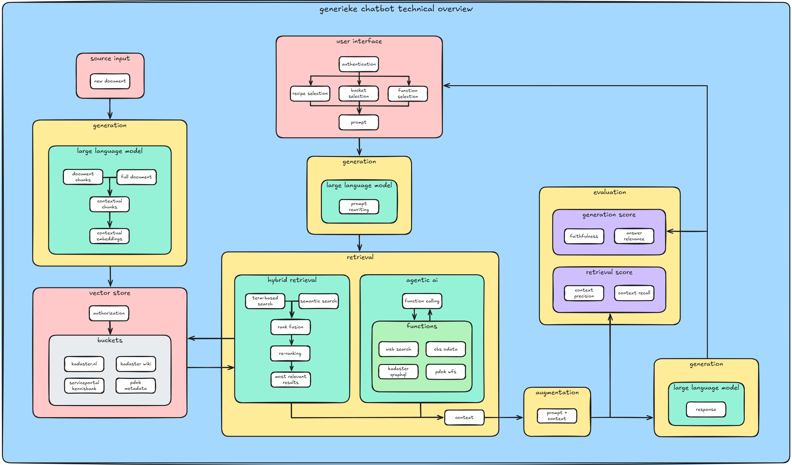

# Chatbot Kaatje

De afgelopen periode heeft Generatieve AI een vlucht genomen en zijn er bij het Data Science Team verschillende verzoeken gekomen voor de ontwikkeling van een chatbot. Om de uniformiteit en standaardisatie te verhogen is er middels een technische verkenning onderzocht of er een generieke chatbot ontwikkeld kan worden die verschillende use cases kan ondersteunen. Binnen deze verkenning is ook een prototype van zo’n generieke chatbot opgeleverd: chatbot Kaatje.

## Werking van Kaatje

### Buckets / RAG

Onze aanpak voor het gronden van de LLM met Kadaster data is gebaseerd op Retrieval Augmented Generation (RAG):

- **Buckets:**  We hebben meerdere buckets, afzonderlijk bevraagbare sets aan data, ingericht waarin tekstfragmenten uit diverse brondocumenten (bijvoorbeeld de Kadaster Wiki, de Kadaster-website en de ServicePortal Kennisbank) worden opgeslagen.
- **Inladen van Data:**  De brondocumenten worden eerst omgezet van HTML naar Markdown. Hierdoor behouden we de structuur (zoals koppen en tabellen) en zorgen we voor heldere, contextuele tekstchunks. Deze chunks worden niet met een standaard sliding window gemaakt, maar op basis van Markdown-koppen, zodat elk fragment inhoudelijk homogeen blijft.
- **Vectorisatie & Hybrid Search:** Met behulp van embedding modellen (zoals text-embedding-3-small en -large via Azure AI Foundry) zetten we de tekst om in vectoren. Vervolgens passen we een hybride zoekmethode toe, waarbij we zowel vector search combineren met traditionele keyword search (bijvoorbeeld BM25).
- **Reranking:** Om de meest relevante documenten te identificeren, wordt er een extra reranking stap uitgevoerd met een tool als de Cohere reranker. Dit zorgt voor een geoptimaliseerde selectie van de bronnen die als context aan de LLM worden meegegeven.
- **Beveiligde Data Toegang:**  Dankzij Row-level security (RLS) heeft elke gebruiker alleen toegang tot de buckets waar hij of zij toestemming voor heeft.

### Function Calling

Naast het ophalen van relevante documenten hebben we de functionaliteit voor het aanroepen van externe tools geïntegreerd, oftewel 'function calling'. Dit is als volgt geïmplementeerd:

- **Dynamische Tool Selectie:**  Afhankelijk van de vraag van de gebruiker kan de chatbot besluiten dat extra, actuele informatie nodig is. Hiervoor worden vooraf gedefinieerde functies of tools aangeroepen.
- **Voorbeelden van Functies:**
  - **Websearch:** Met behulp van de Bing API haalt de chatbot actuele informatie op voor onderwerpen als wetgeving of marktontwikkelingen.
  - **CBS-tool:** Voor statistische en demografische gegevens wordt er data opgevraagd via de CBS API.
  - **Kadaster & PDOK Tools:** Voor vastgoed- en geografische data worden specifieke tools ingezet, die op basis van de gebruikersvraag de relevante data uit de Kadaster databases of PDOK-datasets ophalen.
- **Integratie & Transparantie:**  De stappen en resultaten van deze function calls worden duidelijk weergegeven in de chat omgeving en verwerkt door de LLM in het antwoord. Deze bronvermelding stelt de gebruiker in staat de herkomst van de data te kunnen verifiëren en vergroot het vertrouwen in het systeem.
- **Beheer van Toegang:**  Ook de toegang tot deze externe tools wordt geregeld via dezelfde autorisatie mechanismen als bij de buckets, zodat alleen geautoriseerde gebruikers de functies kunnen activeren.

### Authenticatie en Autorisatie

Voor een veilige en schaalbare toegang tot de chatbot hebben we een centrale OAuth2-oplossing via Kadaster MAP ingezet. Hierbij verloopt alle inkomende communicatie via een OAuth2-proxy, die:

- **Token Validatie**: Alle binnenkomende verzoeken controleert op een geldige OAuth2-token.
- **Gebruikersinformatie Injectie**: Na succesvolle validatie worden de gebruikersgegevens – zoals e-mailadres en bijbehorende rollen – toegevoegd aan de HTTP-request headers.
- **Rechtenbeheer**: Op basis van deze rollen bepaalt de chatbot welke data en functies beschikbaar zijn. Hierdoor krijgen gebruikers alleen toegang tot de buckets en functionaliteiten waarvoor zij geautoriseerd zijn, zonder dat zij aparte accounts hoeven aan te maken.

## Evaluatie

Wij hebben de RAG-functionaliteit systematisch geëvalueerd met behulp van [Ragas](https://docs.ragas.io/en/stable/). Hiervoor hebben we een synthetische vraag-antwoord dataset ontwikkeld, om de antwoorden van de chatbot op te testen. De dataset is gebaseerd op 50 willekeurige documenten per bucket (totaal 150 paren), de vraag en antwoorden zijn gegenereerd met DeepEval [Synthesizer](https://docs.confident-ai.com/docs/synthesizer-introduction). De dataset stelde ons in staat om de output van de chatbot te vergelijken en zo een indicatie te krijgen hoe goed de juiste brondocumenten worden gevonden, en hoe goed het gegeneerde antwoord is.

In onze experimenten hebben we verschillende configuraties getest, zoals het effect van de eerdergenoemde hybrid search en reranking. Ook verschillende embedding modellen en generative modellen. De evaluatieresultaten gaven aan dat het toepassen van reranking in combinatie met hybrid search een bescheiden verbetering (ongeveer 2 %) opleverde. Tevens bleek dat GPT-4o-mini vergelijkbare prestaties leverde als GPT-4o en dat er geen doorslaggevend verschil werd waargenomen tussen small en large embeddings.

Hoewel GPT-4o-mini het op de RAG-benchmark even goed doet als GPT-4o, merken we in de praktijk wel een verschil in beleving tussen beide modellen. Vooral met complexere vragen, of vragen die niet direct door brondocumenten beantwoord kunnen worden. Dit is momenteel nog een limitatie van de testopstellen, gezien de evaluatie dataset alleen de RAG test voor wanneer er een enkel en eenduidig antwoord te vinden is. De dataset kan nog worden uitgebreid met complexere vragen. Ook willen we nog guardrails onderzoeken om te zorgen dat de chatbot alleen binnen zijn domein blijft.

## Conclusie

Middels het prototype “Kaatje” is aangetoond dat er een generieke chatbot ontwikkeld kan worden die de basis kan bieden voor diverse use cases. Bij de ontwikkeling van Kaatje is gekozen voor een eigen chatbot opzet, maar met gebruik van OpenAI modellen die gehost worden door Azure .

Kaatje is een interface waarbinnen gebruikers antwoord krijgen op een breed scala aan vragen. Documenten uit verschillende bronnen kunnen worden ingeladen en afzonderlijk worden bevraagd. Ook is de chatbot uitbreidbaar met verschillende functionaliteiten en kan deze gekoppeld worden met andere systemen middels APIs. Hoewel door het gebruik van generatieve taalmodellen en het open domein onjuistheden en hallucinaties mogelijk zijn, worden die geminimaliseerd door het raadplegen van de verschillende buckets en het toevoegen van bronvermelding.

Het huidige prototype leent zich daarmee voor doorontwikkeling tot volledig product. Deze generieke dienst zou dan ingezet en geconfigureerd kunnen worden voor verschillende producten en diensten binnen en buiten het Kadaster.

## Showcase Prototype

### Chat Pagina



---

### Bronvermelding RAG





---

### Bronvermelding Functies





---

### Multimodaliteit



---

### UI Overig











---

### Admin Page





---

### User Setting Page




