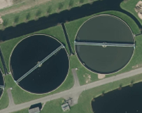
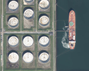
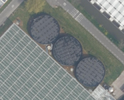
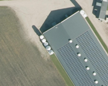
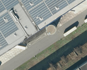
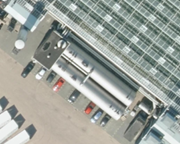
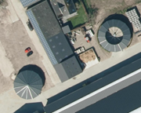

# Use Case: Opslagtanks

## Achtergrond
Kadaster heeft een AI-model is ontwikkeld om opslagtanks op te sporen in luchtfoto's. Het model detecteert de locatie en vorm van tanks, waardoor topografen hun handmatig werk kunnen verminderen en daarmee tijd besparen bij het bijwerken van topografische kaarten. Dit verbetert de efficiëntie en maakt het mogelijk om een breder scala aan opslagtanks te vinden dan voorheen. Verder is ook het inzetten van innovatieve technieken, zoals AI een belangrijk doel voor het realiseren van een nieuwe productiestraat voor BRT.Next

## Onderzoeksvraag en/of doelstellingen
Het onderzoek richtte zich op het gebruik van AI om opslagtanks in luchtfoto's op te sporen. Het doel was om te bepalen of deze technologie betrouwbaar genoeg is voor het identificeren van opslagtanks en of de resultaten geschikt zijn voor topografische kaarten en daarmee ook voor gerelateerde toepassingen zoals landschapsanalyse en handhaving.

## Aanpak
In eerste instantie werd geprobeerd om opslagtanks te detecteren op basis van bestaande opslagtanks in topografische kaarten, en werd alleen onderscheid gemaakt tussen waterzuiveringsinstallaties en andere opslagtanks.

   
De eerste experimenten toonden aan dat het nodig was om meerdere typen opslagtanks te onderscheiden vanwege de grote visuele variatie. Bovendien werden objecten die geen opslagtanks waren vaak onterecht als zodanig gedetecteerd, zoals rotondes, grasvelden, en voedersilo's. Dit probleem werd deels opgelost door meer voorbeeldfoto's aan te bieden en aan te geven dat het geen opslagtank was. Voor objecten die visueel erg op opslagtanks leken, zijn aparte categorieën gemaakt en is extra trainingsmateriaal ontwikkeld om het model te verbeteren.
Uiteindelijk zijn de volgende categorieën of klassen voor het model getraind:
-	Industriële opslagtanks (olie/brandstof/chemie)
-	Open opslagtanks voor mest (bij agrarische bedrijven)
-	Gesloten opslagtanks voor mest (bij agrarische bedrijven)
-	Bassins voor waterzuivering (industriële- of rioolwaterzuivering)
-	Watertanks (bij kassen)
-	Voedersilo’s (ook wel gleufsilo’s, bij agrarische bedrijven)
-	Thermische opslag (voor warmte- en/of koudeopslag, bij kassen en grootte loodsen)
-	Liggende tanks (voor water/warmte bij kassen en ook losse propaantanks)
-	Drafmolens (loopmolens voor paarden)
-	Longeercirkels (voor trainen van paarden)

 

 

          
## Resultaten
Een YOLOv8-model is gebruikt om objecten te detecteren, door hun locatie en vorm op foto’s aan te duiden.
De gedetecteerde objecten zijn vergeleken met een topografische kaart, waarbij bleek dat veel verschillen (85%) terecht gevonden zijn en de kaart moet worden bijgewerkt. Echter, er zijn ook gemiste objecten en foutieve detecties vastgesteld, wat suggereert dat het model verder kan worden verbeterd door meer trainingsdata toe te voegen. Ook kan met nabewerking de kwaliteit van de uiteindelijke dataset nog verder verbeterd worden. Verder kan ook het gebruik van True Ortho luchtfoto's ook helpen, omdat deze omvallingscorrectie bevatten. Hierdoor wordt ook de locatie en de vorm van de gevonden opslagtanks nauwkeuriger.

## Conclusies/aanbevelingen
AI gebruiken voor het detecteren van locatie en vorm van opslagtanks blijkt zeer goed mogelijk. Door de gevonden opslagtanks te vergelijken met de bestaande topografische producten is het mogelijk nieuwe en verwijderde objecten te vinden. 
Wel lijkt het voorlopig goed om elk gevonden verschil nog door een topgraaf te laten boordelen. Evengoed zal dit een aanzienlijke tijdsbesparing kunnen leveren op het huidige handmatige proces.
Door ook nieuwere generaties AI technieken toe te passen lijkt het aannemelijk dat de detectie van locaties en vorm nog verder te verbeteren is. Voorwaarde voor het vinden van betere vormen is dan wel dat luchtfoto’s als True Ortho foto’s beschikbaar moeten zijn.  

## Vragen over dit project? 
Voor meer informatie kun je terecht bij Peter Brouwer (ODR/GEC). 
