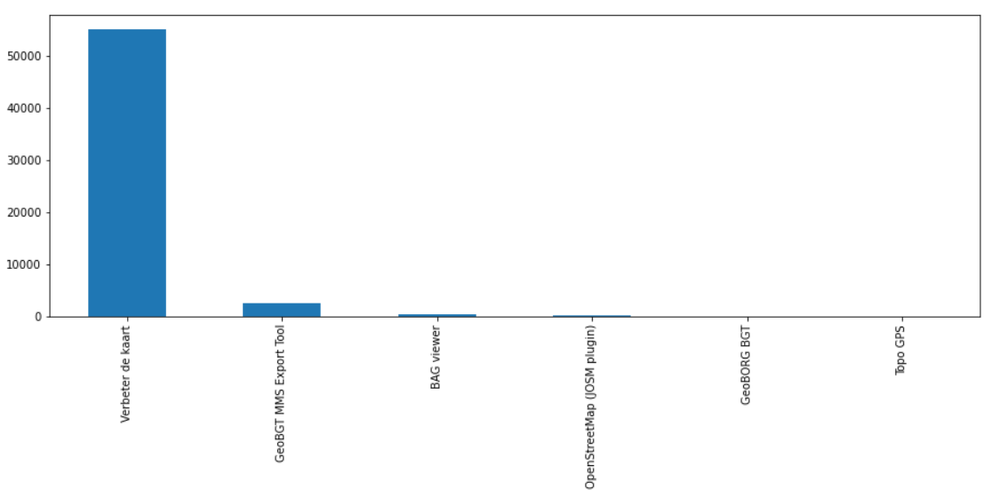
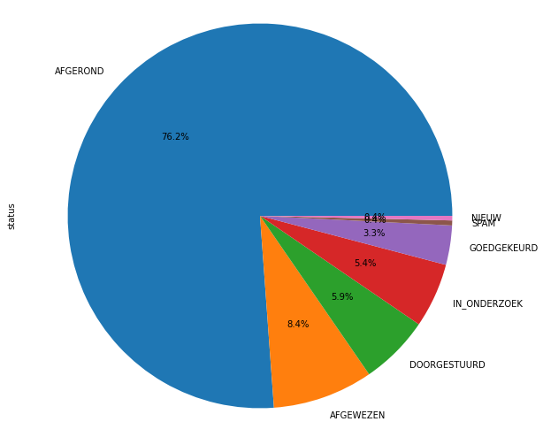
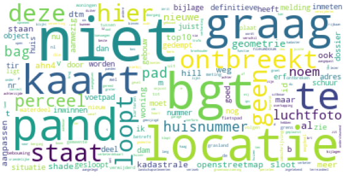

# BGT terugmeldingen analyse

 

## 1. Inleiding
Gebruikers van de Basisregistratie Grootschalige Topografie (BGT) kunnen bij twijfel aan de juistheid van een gegeven een zogenaamde Terugmelding doen. Hiermee geven ze aan dat ze denken dat dit gegeven niet juist is. Het is aan de bronhouders te beoordelen of deze melding terecht is en zo ja om het gegeven te corrigeren.

Terugmeldingen kunnen worden gedaan door burgers, bedrijven en overheden. In vrijwel alle meldingen wordt alleen in een "vrij tekstveld" informatie over de terugmeldingen meegegeven. Vanuit het BGT team kregen wij als Datascience Team de vraag of wij uit deze "vrije tekstvelden" waardevolle inzichten konden bieden over de terugmelding. Om dit te realiseren hebben wij een export (csv bestand) van de data ontvangen vanuit het terugmeldsysteem. 

In onderstaande figuur is de verhouding van de terugkoppelingen per kanaal te zien.

 
<figure id="figuur-3">
  
  <figcaption>
    Figuur 1 ― aantal BGT terugmeldingen per kanaal. 
  </figcaption>
</figure>
 

## 2. Doel Onderzoek
Het doel van dit project is om inzicht te bieden op de volgende onderzoeksvragen;
 
-	Op welke BGT-objecttypen vinden de terugmeldingen plaats.
 
- Wat is de afhandelingstermijn van de terugmeldingen per objecttype.
 
- In welke mate komt de afhandelingstermijn van een terugmelding overeen met de actualiteitseis van het BGT-objecttype.
 

## 3. Aanpak
Op dit moment worden jaarlijks gemiddeld 7000 terugmeldingen gedaan op de BGT. Deze datastory is gebaseerd op analyse van alle, ruim 40.000 terugmeldingen. In onderstaande grafiek is te zien dat, logischerwijs, iets minder dan een kwart van alle terugmeldingen nog niet is afgerond.
 
<figure id="figuur-4">
  
  <figcaption>
    Figuur 2 ― status van BGT terugmeldingen. 
  </figcaption>
</figure>
 
Het veld "omschrijving" is gebruikt voor de tekstanalyse. De omschrijving bestaat uit vrije tekst van verschillende lengtes en detaillering, soms bevat het alleen de naam van het object en in andere gevallen de volledige beschrijving van het probleem. Deze teksten hebben we door middel van een zogenoemde Word Cloud weergegeven in onderstaande afbeelding.
 
<figure id="figuur-1">
  
  <figcaption>
    Figuur 3 ― wordcloud van veel voorkomende woorden in de BGT terugmeldingen. 
  </figcaption>
</figure>
 
<figure id="figuur-5">
  
  <figcaption>
    Figuur 4 ― wordcloud van veel voorkomende woorden in de BGT terugmeldingen die niet geclassificeerd zijn bij een objecttypen. 
  </figcaption>
</figure>
 
Voor de volgende stap hebben we een lijst met BGT-objecttypen ontvangen. In dit bestand staan onder andere veelgebruikte afkortingen en synoniemen van de objecttypen. Een voorbeeld hiervan is het objecttype pand; deze wordt ook vaak geschreven als huis, gebouw, woning etc. Met deze lijst hebben wij doormiddel van reguliere expressie gekeken of de woorden voorkomen in het “vrije tekstveld” en zodoende er een objecttype aan gekoppeld. Indien er meerdere woorden in een vrij tekstveld voorkomen, pakt het model op dat moment het objecttype met de hoogste hiërarchie.
 
Wanneer een melding wordt geregistreerd in het systeem krijgt het een tijdstip registratie/wijzigen, mogelijk een korte toelichting door de bronhouder, een datum van afronding en een bronhouder naam/code. De afhandelingstermijn van een terugmelding is berekend door het verschil in dagen te berekenen tussen tijdstip registratie en tijdstip afronding/afwijzing/doorgestuurd.

## 4.	Resultaten 

In onderstaande figuur zijn de resultaten van de eerste twee onderzoeksvragen gecombineerd, waarin is te zien dat de meest voorkomende objecten in de terugmeldingen panden en wegen zijn en dat deze gemiddeld binnen 159 en respectievelijk 157 dagen zijn afgehandeld.

  

| objecttypen                   |aantal |doorlooptijd |
|-------------------------------|------:|---:|
| pand                          | 11649 |159 |
| wegdeel                       | 10852 |157 |
| begroeid terreindeel          | 3590  |154 |
| waterdeel                     | 3480  |163 |
| overig bouwwerk               | 1087  |155 |
| vegetatieobject               | 988   |122 |
| onbegroeid terreindeel        | 843   |128 |
| ondersteunend wegdeel         | 837   |69  |
| overbruggingsdeel             | 383   |169 |
| kunstwerkdeel                 | 287   |263 |
| scheiding                     | 211   |170 |
| spoor                         | 73    |121 |
| ondersteunend waterdeel       | 62    |132 |
| tunneldeel                    | 35    |294 |

 

