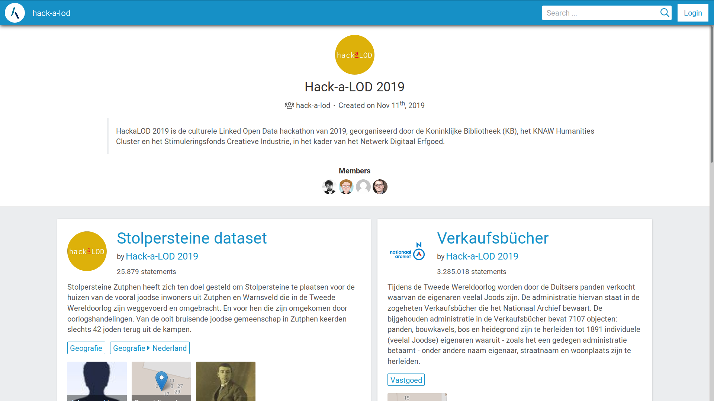

# Hack-a-LOD 2019

Voor deze Hack-a-LOD zijn we geïnspireerd door het werk van de kunstenaar [Günter Demnig](http://www.stolpersteine.eu/faq/) die Joden die gedeporteerd zijn tijdens de Tweede Wereldoorlog probeert te herdenken via zogeheten ‘Stolpersteine’ of ‘Struikelstenen’.  Voor de Hack-a-LOD focussen we ons op de Joden die gedeporteerd zijn uit Zutphen, maar de struikelstenen liggen door heel Europa, zoals Linked Databron Wikidata ons laat [zien](https://query.wikidata.org/#%23Cats%0ASELECT%20%3Fitem%20%3FitemLabel%20%3Flocation%20%3Fimg%0AWHERE%20%0A%7B%0A%20%20%3Fitem%20wdt%3AP31%2Fwdt%3AP279%2a%20wd%3AQ26703203%20.%0A%20%20OPTIONAL%20%7B%3Fitem%20wdt%3AP625%20%3Flocation%7D%0A%20%20OPTIONAL%20%7B%3Fitem%20wdt%3AP18%20%3Fimg%7D%0A%20%20SERVICE%20wikibase%3Alabel%20%7B%20bd%3AserviceParam%20wikibase%3Alanguage%20%22%5BAUTO_LANGUAGE%5D%2Cen%22.%20%7D%0A%7D).

## Stolpersteine

In Zutphen liggen 131 Stolpersteine. In [Figuur 1](#figuur-1) wordt getoond waar de stenen precies liggen en welke mensen in herinnering worden geroepen.  Deze dataset is door ons als naar Linked Data omgezet en online gepubliceerd.

<figure id="figuur-1">
  <query data-config-ref="https://data.labs.kadaster.nl/hack-a-lod/-/queries/adressen">
  </query>
  <figcaption>
    Figuur 1 ― De 131 Stolpersteinen die in Zutphen liggen.
  </figcaption>
</figure>

## Verkaufsbücher

Wanneer Joden werden afgevoerd, kwamen hun huizen leeg te staan. De huizen werden geconfisqueerd door de bezetter en doorverkocht.  In de Verkaufsbücher is gedurende de Tweede Wereldoorlog nauwkeurig geregistreerd welke panden van voornamelijk Joodse eigenaren zijn ‘verkocht’.  We kunnen zien, wanneer de huizen van Joden werden verkocht, maar ook aan wie. Een aantal mensen kocht een flink aantal huizen aan.  De tijdlijn hieronder ([Figuur 2](#figuur-2)) geeft weer wanneer deze huizen werden verkocht. De verkopen zijn niet gelijk verspreid over de oorlogsjaren, maar geclusterd in de tijd. Wat opvallend is, is dat deze clusteringen niet samen vallen met grote razzia's, zoals die van [17/18 november 1942](https://www.omroepgelderland.nl/nieuws/2148359/Jodenjacht-in-Gelderland-de-nacht-dat-honderden-Joden-worden-afgevoerd-naar-Westerbork).

<figure id="figuur-2">
  <query data-config-ref="https://data.labs.kadaster.nl/hack-a-lod/-/queries/timeline-sold-property">
  </query>
  <figcaption>
    Figuur 2 ― Tijdslijn die aangeeft wanneer huizen zijn verkocht.
  </figcaption>
</figure>

## Link tussen Stolpersteine & Verkaufsbücher

Met de koppeling van de Stolpersteine aan verkochte panden uit de Verkaufsbücher krijgen de slachtoffers letterlijk een gezicht.  De biografische gegevens zijn afkomstig uit de dataset van Stolpersteine Zutphen.  Bovendien wordt op de kaart ([Figuur 3](#figuur-3)) duidelijk bij welke onteigende panden de oorspronkelijke eigenaar niet is teruggekeerd en er waarschijnlijk nooit aanspraak is gemaakt op rechtsherstel.

<figure id="figuur-3">
  <query data-config-ref="https://data.labs.kadaster.nl/hack-a-lod/-/queries/kaart-zutphen">
  </query>
  <figcaption>
    Figuur 3 ― Kaart van panden die voorkomen in de Stolpersteine én in de Verkaufsbücher.
  </figcaption>
</figure>

## Stolpersteine & Verkaufsbücher: Personen

De slachtoffers van de razzia's wiens huizen werden verkocht en wie reeds worden herdacht middels een Struikelsteen, hebben een plaats in de galerij hieronder ([Figuur 4](#figuur-4)). Het bijschrift bevat links, die direct dieper in de Linked Data inleiden. Zo kan men door klikken naar de adressen die gelinkt zijn aan de Basisregistratie Adressen en Gebouwen ([BAG](https://www.geobasisregistraties.nl/basisregistraties/adressen-en-gebouwen)), maar ook op links naar personen die bij de transacties betrokken waren.

<figure id="figuur-4">
  <query data-config-ref="https://data.labs.kadaster.nl/hack-a-lod/-/queries/gallerij-zutphen">
  </query>
  <figcaption>
    Figuur 4 ― Galerij van personen die in de Stolpersteine én in de Verkaufsbücher voorkomen.
  </figcaption>
</figure>

## Tot slot

Alle data is als Linked Data beschikbaar gesteld in de Kadaster Labs
omgeving.  Hierbij worden de volgende datasets gebruikt:

  - [Basisregistratie Adressen en Gebouwen (BAG)](https://data.labs.kadaster.nl/kadaster/bag) (Kadaster)
  - [Verkaufsbücher](https://data.labs.kadaster.nl/hack-a-lod/verkaufsbucher) (Nationaal Archief)
  - [Stolpersteine](https://data.labs.kadaster.nl/hack-a-lod/stolpersteiner) (Hack-a-LOD)
  - [Linkset Stolpersteine ↔ BAG](https://data.labs.kadaster.nl/hack-a-lod/stolpersteiner-bag) (Hack-a-LOD)
  - [Linkset Verkaufsbücher ↔ BAG](https://data.labs.kadaster.nl/hack-a-lod/verkaufsbucher) (Nationaal Archief & Kadaster)

Bezoek <a href="https://data.labs.kadaster.nl/hack-a-lod" target="_blank">https://data.labs.kadaster.nl/hack-a-lod</a> voor alle bronnen.

<figure id="figuur-5">
  
  <figcaption>
    Figuur 5 ― Klik op het plaatje om de gebruikte Linked Datasets te bezoeken.
  </figcaption>
</figure>
